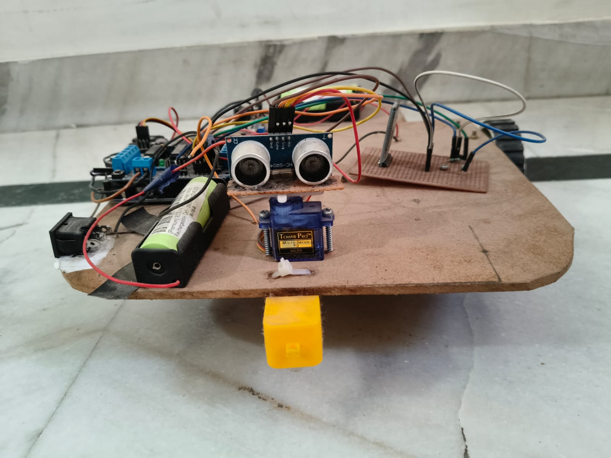
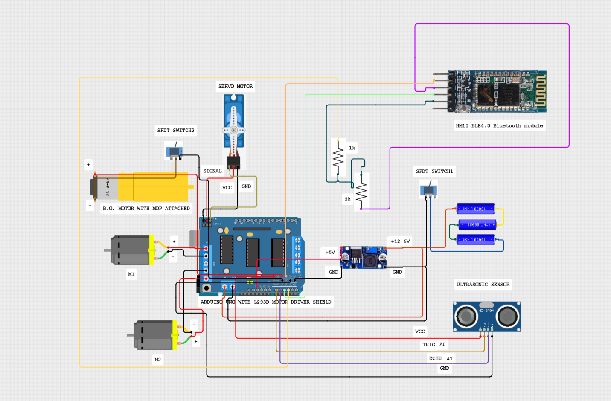
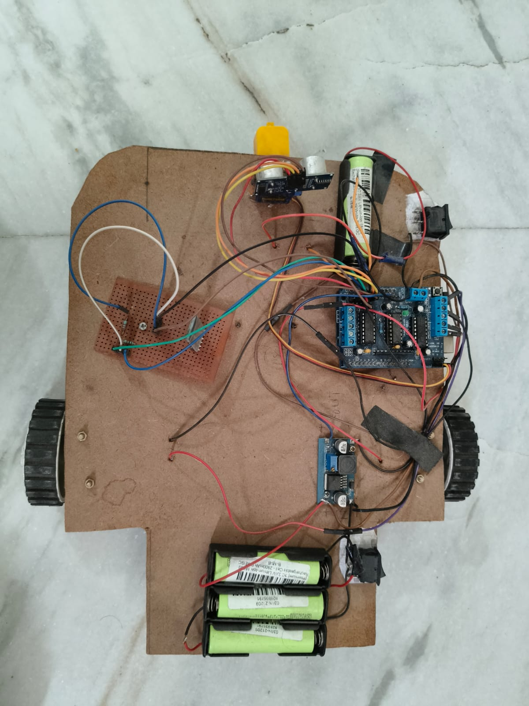

<h1 align="center">Obstacle Avoidance Robot</h1>

An Arduino Uno R3-based obstacle avoidance robot featuring autonomous navigation, Bluetooth-based manual control, and an optional modular cleaning attachment. Designed using embedded systems, ultrasonic sensing, motor control, and wireless communication for versatile robotic applications.

## Table of Contents

- Overview
- Features
- Hardware
- Software
- Working Principle
- Circuit Diagram
- Images
- Getting Started
- Future Improvements
## Overview
The Obstacle Avoidance Robot is an Arduino Uno R3-based robot capable of operating in both Autonomous and Manual modes. In Autonomous Mode, an HC-SR04 ultrasonic sensor mounted on an SG90 servo motor detects obstacles and enables intelligent path selection, while an L293D Motor Driver Shield controls the DC gear motors. Manual operation is achieved through an HM-10 BLE 4.0 Bluetooth module. The robot also supports an optional cleaning functionality by integrating a front-mounted BO motor with a rotating mop attachment.
## Features
*  Autonomous obstacle detection and intelligent obstacle avoidance
*  Bluetooth-based manual control using the HM-10 BLE 4.0 module
*  Dual operating modes: Autonomous and Manual
*  2–400 cm obstacle detection using the HC-SR04 ultrasonic sensor
*  180° environmental scanning using an SG90 micro servo motor
*  Differential drive using two 12 V, 100 RPM DC geared motors
*  Stable 5 V power regulation using the LM2596 buck converter
*  Modular design supporting an optional floor-cleaning attachment
*  Rechargeable battery-powered operation using 18650 Li-ion cells
*  Compact, lightweight, and modular robotic platform

[Demo Video](https://youtube.com/shorts/mNPdL-6ve8M?si=yQ3NQIR1cIkRjhgK)
## Hardware
For the complete list of hardware components, descriptions, specifications, and quantities used in this project, refer to 

## Software

| Software / Library     | Purpose                                                |
| ---------------------- | ------------------------------------------------------ |
| Arduino IDE            | Code development and program upload                    |
| C++                    | Programming language                                   |
| AFMotor Library        | Controls the L293D Motor Driver Shield                 |
| Servo Library          | Controls the SG90 servo motor                          |
| SoftwareSerial Library | Enables serial communication with the HM-10 BLE module |
## Working principle
The robot continuously measures the distance to nearby obstacles using the HC-SR04 ultrasonic sensor mounted on an SG90 servo motor. During autonomous operation, the servo rotates the sensor to scan the surrounding environment and determine the available free space. Based on the measured distances, the Arduino Uno executes the obstacle avoidance algorithm and controls the two DC gear motors through the L293D Motor Driver Shield to navigate safely.

For manual operation, the HM-10 BLE 4.0 Bluetooth module establishes wireless serial communication with a Bluetooth-enabled mobile device, allowing the user to remotely control the robot. The platform also supports an optional cleaning module consisting of a BO motor with a rotating mop attachment powered by an independent battery supply.
## Circuit Diagram

## Images

## Getting Started

### Prerequisites

* Arduino IDE
* Arduino Uno R3
* Required Arduino libraries:

  * AFMotor
  * Servo
  * SoftwareSerial

### Installation

1. Clone or download this repository.
2. Install the required libraries in the Arduino IDE.
3. Open the `Obstacle_Avoidance_Robot.ino` file present in the `Arduino_Code` folder in this repository.
4. Select Arduino Uno as the target board.
5. Choose the appropriate COM port.
6. Upload the code to the Arduino Uno R3.
7. Connect the battery pack and power ON the robot.

### Operating Modes

* Autonomous Mode: The robot detects obstacles and automatically selects a safe path for navigation.
* Manual Mode: Connect to the HM-10 BLE module using a compatible Bluetooth terminal or mobile application to control the robot wirelessly.
## Future Improvements

* Develop a dedicated mobile application for Bluetooth control.
* Integrate Wi-Fi or IoT connectivity for remote monitoring and operation.
* Replace the ultrasonic sensor with LiDAR for improved obstacle detection accuracy.
* Implement camera-based object detection using Computer Vision.
* Add autonomous charging and battery management capabilities.
* Incorporate GPS and SLAM algorithms for advanced navigation.
* Improve the chassis design using 3D-printed components for enhanced durability and aesthetics.
* Expand the cleaning module with an automatic water dispensing mechanism for wet mopping.
---
##  Author

**Nandini Singh**

B.Tech Electronics(IoT)

GitHub: https://github.com/nandini2027

